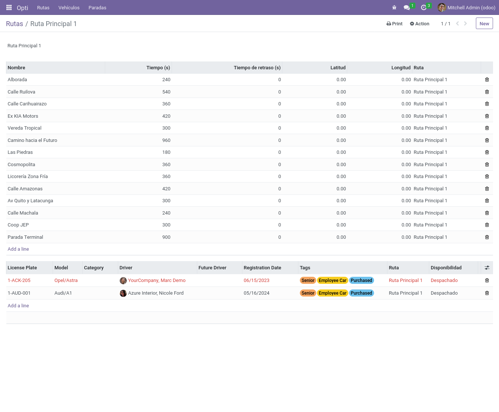

# Building a Module.

Este es un proyecto realizado con la finalidad de explorar y aprender sobre el desarrollo de módulos de Odoo. El proyecto define 2 módulos:
- **Cowsay:** Básicamente un "Hola mundo", pero mostrando mensajes de la forma en la que lo hace el comando `cowsay`
- **Opti:** Un módulo que administra Paradas, rutas y vehículos. Pensando en el manejo y revisión de vehículos recorriendo distintas rutas

## Índice
1. [Capturas](#Capturas)
2. [Tópicos aprendidos durante el proyecto](#Tópicos_aprendidos_durante_el_proyecto)
3. [Cosas por reforzar](#Cosas_por_reforzar)
4. [Ejecutar el proyecto](#Ejecutar_el_proyecto)

## Capturas
### Cowsay


### Opti





## Tópicos aprendidos durante el proyecto
- Herencia de entidades y vistas
- Estructura básica de un módulo
- Habilitar el modo desarrollador y utilizarlo para inspeccionar una vista o saber los nombres de una entidad
- Definición de modelos con campos calculados
- Relaciones entre entidades
- Permisos de entidades
- Reportes con pdf
- Información de demostración
- Declaración de interfaces gráficas para la administración de entidades mediante XML
- Agrupación de entidades en las vistas
- Workflows
- Wizards
- Tipos de usuario en Odoo
- Instalar módulos en Odoo

## Cosas por reforzar
- Sintaxis del templating utilizado para las plantillas
- Conocer más tipos de vistas
- Prácticas al organizar un módulo

## Ejecutar el proyecto
> [!NOTE]
> Para ejecutar el proyecto se requiere de una instalación de docker, docker-compose y python 3.10 hasta 3.12

1. Clonar el repositorio
```sh
git clone --recurse-submodules --shallow-submodules https://github.com/Davido264/ms-capacitation.git
```

2. Ejecutar el servicio
```sh
docker-compose up
```

3. Instalar las los módulos:
    - `opti`
    - `cowsay`
